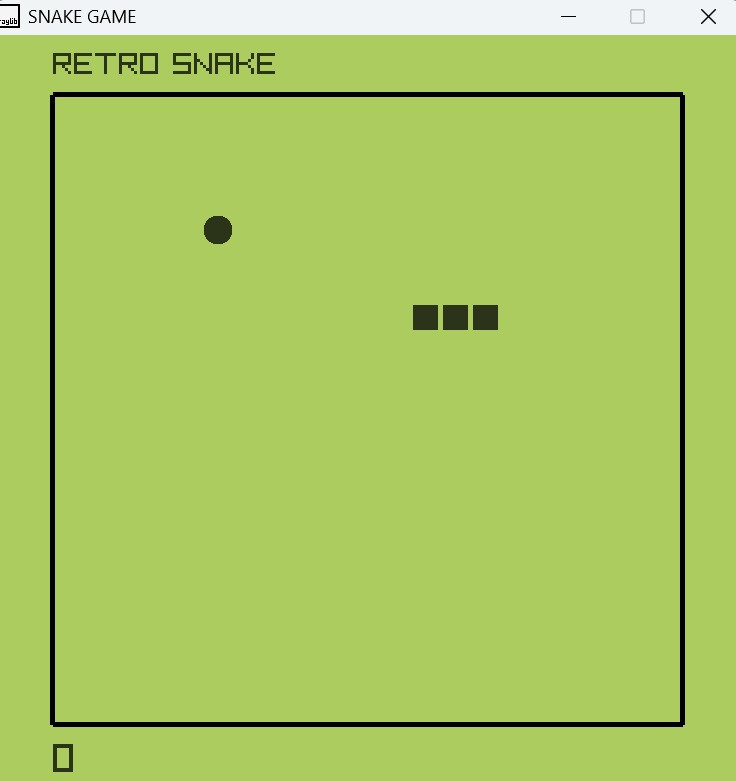

# SNAKE GAME

A very interactive game made in c++ using ray-lib library. Ray-lib is very easy to use gaming library for creating 2D and 3D game.
Snake game is this recreation of the OG retro snake game that we used play in key-pad phones.

## ABOUT GAME

In this game a snake eat its food and grows in length, every time snake eats food score increases by one, if snake collides with the wall or hit itself then game overs.
## HOW TO PLAY

Use Arrow KEY to control the snake, to make it eat its food.
And the cach is this if snake is moving in some direction snake can not move in opposite direction
at that instant.
## INSTALLATION

HOW WE CAN INSTALL IT?

Download the repositary zip by clicking on '<> code' icon in repositary.

After unzipping the file, you will find main.exe, run main.exe file.

Window protection menu will pop up, click on 'more info', then 'run anyway'.
## Screenshots

